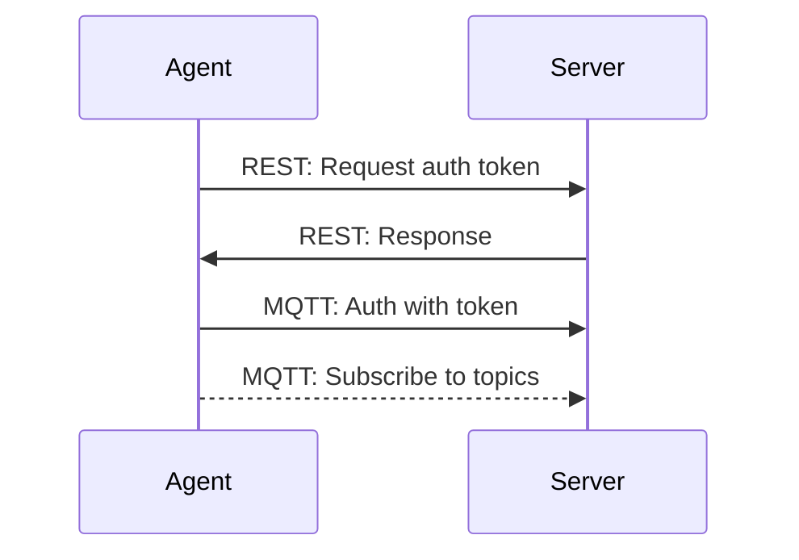

# Agent communication

## MQTT

### Topics

* `pixconf/agent/<agent name>/commands` - Read: Agent listens for commands from the server
* `pixconf/agent/<agent name>/response/<uuid>` - Write: Agent sends response of a command to the server
* `pixconf/agent/<agent name>/health` - Write: Agent sends health status to the server
